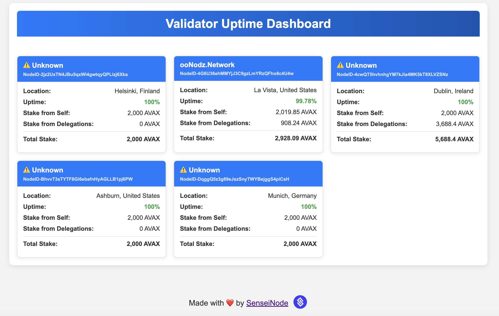

# Avalanche Validator Dashboard

A simple Flask dashboard to monitor multiple Avalanche validators using the Avascan API.



## Prerequisites
- Python 3.7+ or Docker (with Compose)

## Quick Start

1. Clone the repository:
```sh
git clone https://github.com/Sensei-Node/avax-validator-dashboard.git
cd avax-validator-dashboard
```

2. Edit `config.json` to set your validator node IDs and refresh interval.
3. Run with Python or Docker:

### Python
```sh
# Create and activate virtual environment
python -m venv venv
source venv/bin/activate

# Install dependencies
pip install -r requirements.txt

# Run the app
python app.py

# Open http://localhost:5000
```

### Docker
```sh
docker compose up -d

# Open http://localhost:5000
```

## Contributing
PRs welcome! 🚀

---
Made with ❤️ by [SenseiNode](https://senseinode.com)
