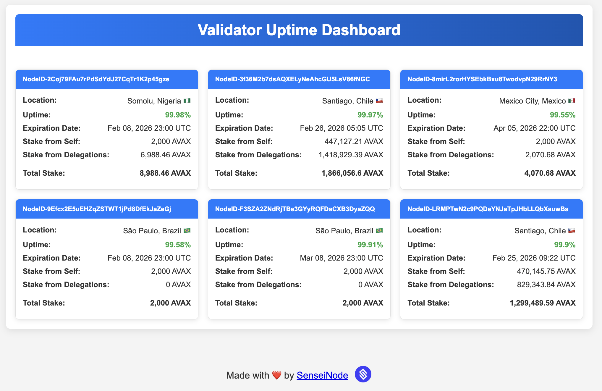

# Avalanche Validator Uptime Dashboard

This is a simple Flask web application that monitors the uptime of multiple Avalanche validators using data from Avascan.



## Features
- Fetches validator uptime dynamically
- Displays validator details including:
  - Name
  - Location
  - Uptime percentage
  - Stake from self
  - Stake from delegations
- Auto-refresh every 5 seconds

## Installation

### Prerequisites
- Python 3.7+
- pip

### Clone the Repository
```sh
git clone https://github.com/your-repo/avalanche-validator-dashboard.git
cd avalanche-validator-dashboard
```

### Install Dependencies
```sh
pip install -r requirements.txt
```

## Usage

### Run the Flask App
```sh
python app.py
```

### Open in Browser
Once the server is running, open:
```
http://127.0.0.1:5000/
```

## Project Structure
```
/your_project/
├── app.py                # Main Flask application
├── requirements.txt      # Required dependencies
├── static/               # Static files (e.g., favicon)
│   ├── avax.ico          # Optional favicon
├── templates/            # HTML templates
│   ├── dashboard.html    # Main dashboard UI
└── README.md             # Project documentation
```

## API Endpoint Used
This app fetches data from:
```
https://api.avascan.info/v2/network/mainnet/staking/validations?nodeIds=<NODE_IDS>&status=active
```

## License
MIT License

## Contributing
Feel free to submit issues and pull requests!

---
Made with ❤️ for Avalanche node operators! 🚀
